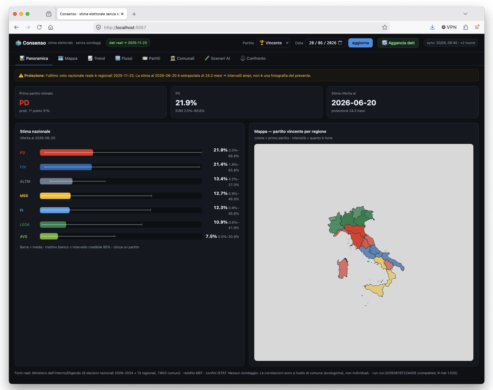
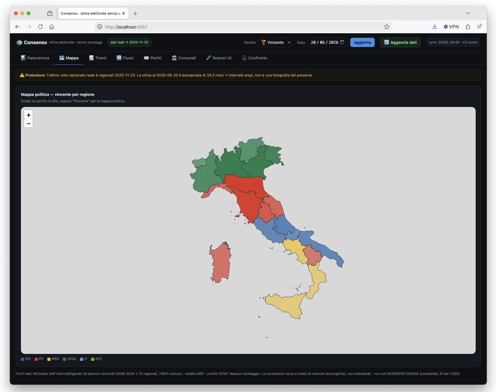
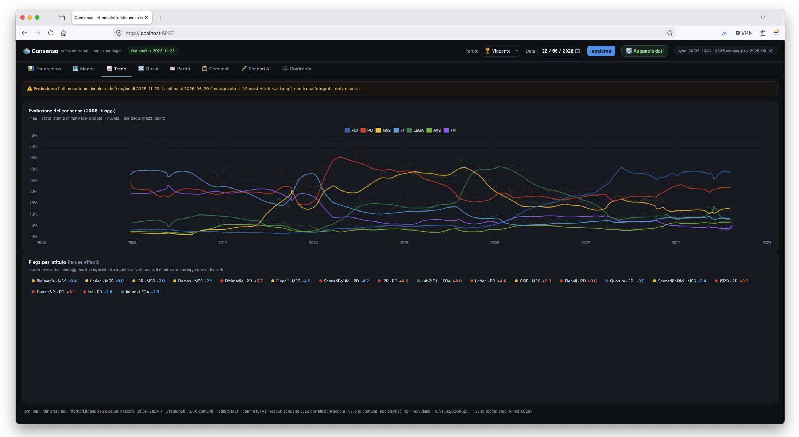
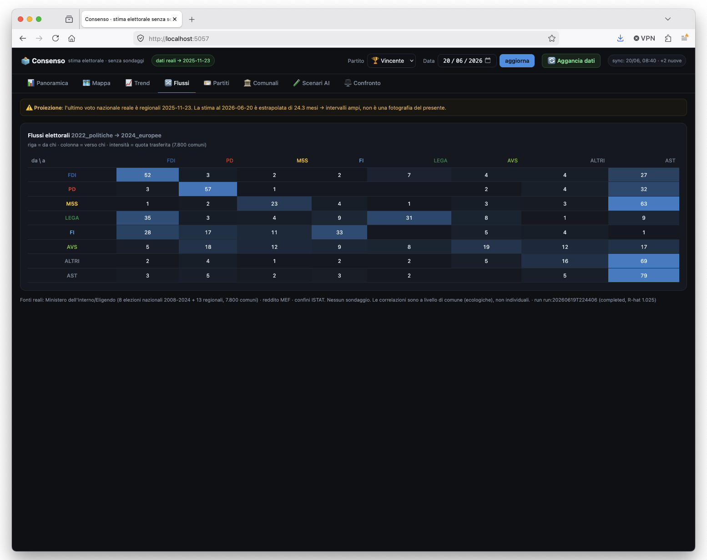
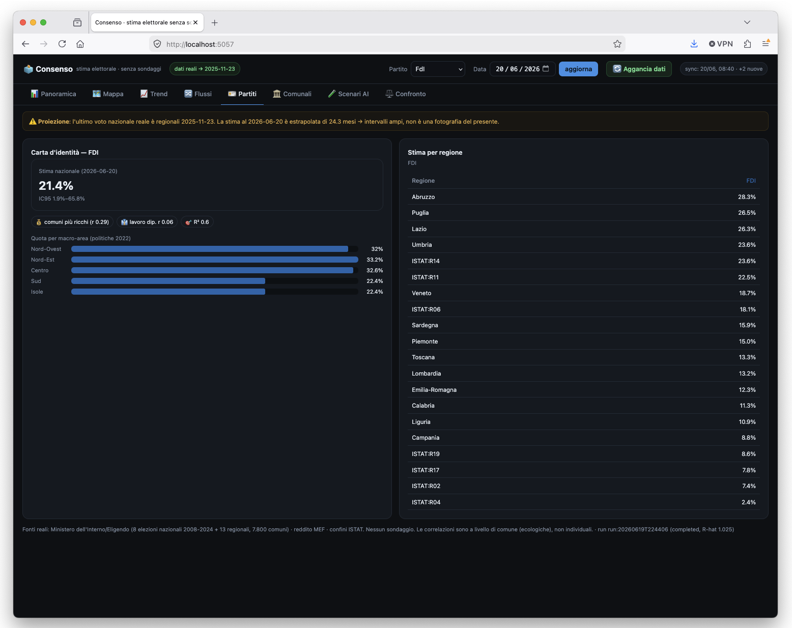
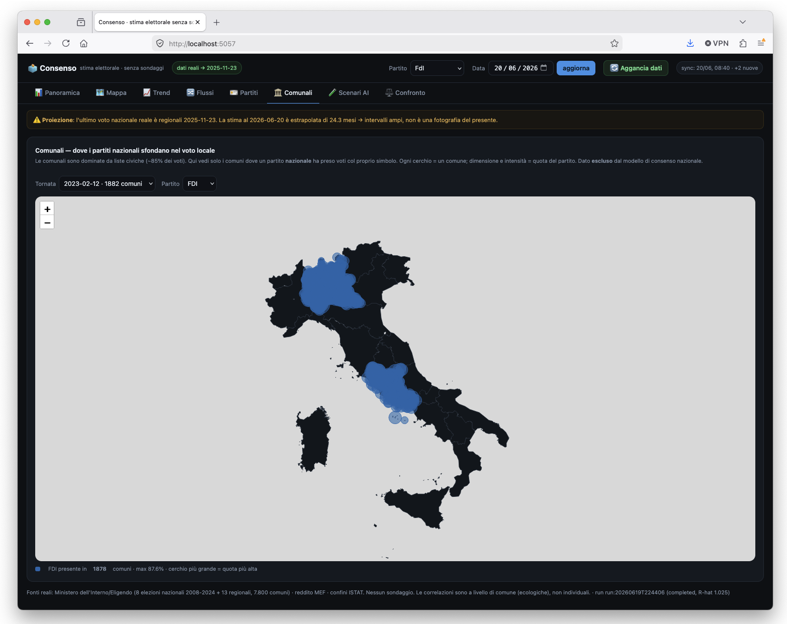
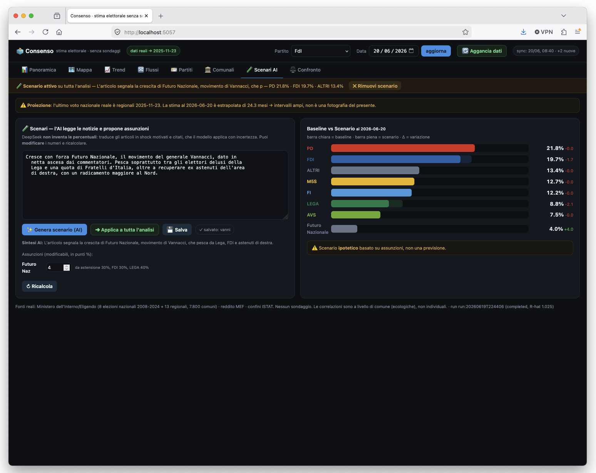
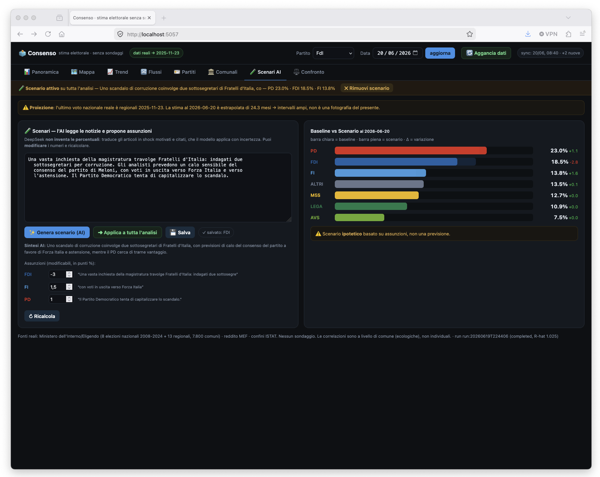
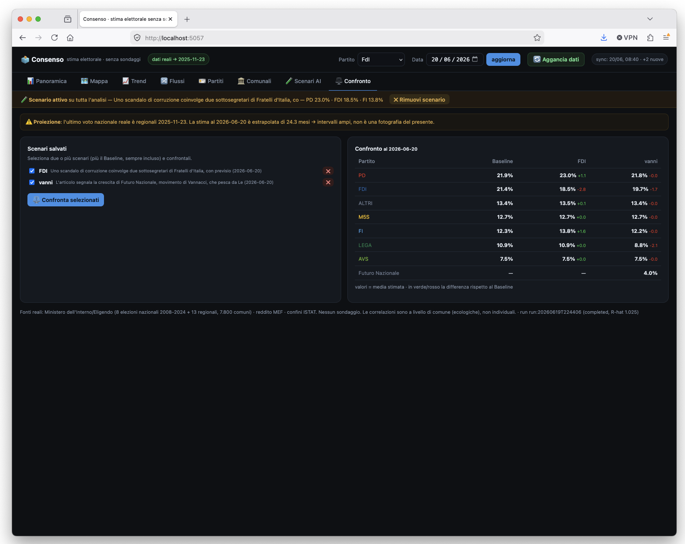

# Consenso — continuous estimation of Italian party support, without polls

**Consenso** estimates the current support of Italian political parties using **only real, public electoral data** — no opinion polls. Every election (general, European, regional, municipal) is treated as a *noisy, biased measurement* of a latent national consensus, and a Bayesian state‑space model recovers that latent state over time, with honest uncertainty.

> **Why it exists.** This started from a conversation on X with a friend, who asked a deceptively simple question: *"from a mathematician's point of view, is there an alternative to polls — a model that exploits [Eligendo](https://elezionistorico.interno.gov.it/), even if elections are too staggered to be fully reliable?"*. I tried to build it. The full story (in Italian) is on my blog **Signal Pirate**: [**Il Consenso Senza Sondaggi**](https://pinperepette.github.io/signal.pirate/articoli/il-consenso-senza-sondaggi.html).

---

## What it does

- **Estimates** each party's national and regional support as a **probability distribution** (mean, 95% credible interval, P(share > threshold)), not a single number.
- **Reconstructs** the historical trajectory of consensus from 2008 to today.
- **Estimates electoral flows** between consecutive elections (where votes go: e.g. *M5S → abstention*, *Lega → FdI*).
- **Maps** the vote geographically (winner per region, choropleth per party, municipal‑level breakouts).
- **Explains the drivers** with a spatial machine‑learning model (geography vs income vs occupation).
- **Runs "what‑if" scenarios**: an LLM reads news articles and turns them into *explicit, sourced assumptions*; the model computes the consequences, with the scenario applicable to the whole analysis and comparable side by side.
- **Self‑updates**: an auto‑sync job pulls newly published elections from the Ministry archive **and the latest opinion polls (live from Wikipedia)**, then re‑runs the model. New parties (e.g. a poll‑only newcomer) are picked up automatically, in the model and in the UI.

## Screenshots

| Overview | Map (winner per region) | Historical trend |
|---|---|---|
|  |  |  |

| Electoral flows (2022 → 2024) | Party profile | Municipal breakout |
|---|---|---|
|  |  |  |

| AI scenario (new party enters) | AI scenario (a scandal) | Scenario comparison |
|---|---|---|
|  |  |  |

---

## How it works

**The core idea.** A poll asks a sample for an intention; an election is something that *actually happened*, counted across the whole population. Each election, though, measures a slightly different thing. The model separates the structural signal from the deformation.

- **Latent state** lives on the simplex via additive log‑ratio (ALR) + softmax, so shares always sum to 1.
- **State equation** — the consensus drifts as a continuous‑time random walk: `η_t = η_{t-1} + ω_t`, `ω_t ~ N(0, Q·Δt)`.
- **Observation equation** — an election sees the state through a lens: `y_{k,e} = η_{k,t(e)} + β_{k,τ(e)} + γ(turnout) + ε`, where `β` is the **election‑type bias** (general elections are the anchor, `β = 0`).
- **Hierarchy** — national → regional with partial pooling, so a strong regional result (e.g. Liga Veneta in Veneto) feeds a *regional offset*, not the national figure.
- **Inference** — NUTS / Hamiltonian Monte Carlo ([NumPyro](https://num.pyro.ai/)).
- **Flows** — Bayesian ecological inference (Dirichlet transfer matrices) on municipal aggregates.
- **Spatial model** — RandomForest predicting municipal shares from geography + income (MEF) + occupation.
- **Scenarios** — [DeepSeek](https://www.deepseek.com/) turns articles into structured assumptions; the engine applies them to the posterior samples and propagates uncertainty.

## Data sources (all real, all public)

- **Ministero dell'Interno / Eligendo** — election results down to municipality (general, European, regional, municipal), turnout. Downloaded straight from the open‑data archive.
- **ISTAT** — territorial codes, geographic boundaries, municipal income (MEF series).
- **Opinion polls** are an optional, clearly‑labelled channel (off in the core reconstruction and in the backtest). When enabled, they enter as a *weak, indicative* signal with variance inflated to the **real, measured poll error** (~3.2 pts, about 2.2× the nominal sampling margin), so the facts (elections) stay the anchors. Historical series back to 2008 plus live updates from Wikipedia; auto‑sync uses them to estimate the **present** — the inter‑election gap the model otherwise cannot fill — while a poll‑only party (e.g. a new entrant) is tracked separately and masked in every election.

A correctness check: recomputing national turnout by summing all ~7,800 municipalities gives **64.0%** (2022 general) and **49.7%** (2024 European), identical to the official figures.

---

## Quickstart

Requires Python 3.10+ and a running **MongoDB** (`mongodb://localhost:27017`).

```bash
pip install -r requirements.txt          # includes jax[cpu], numpyro, arviz, flask, pymongo
python scripts/init_db.py                # create collections + indexes

# ingest a real election (from an Eligendo CSV/URL or a local file)
python scripts/run_ingest.py --election-id elez:2022_politiche --type politiche \
    --date 2022-09-25 --geo-level comune --results-file results.csv --turnout-file turnout.csv

# bulk loaders for the real Ministry open-data archive
python scripts/load_opendata.py          # municipality-level CSVs (2022 / 2024)
python scripts/load_regionali_2025.py    # 2025 regional rounds

python scripts/run_model.py              # assemble → NUTS → materialize estimates
python scripts/run_backtest.py --train-until 2018-12-31   # out-of-sample validation

# serve the dashboard
CONSENSO_DB=consenso FLASK_APP=consenso.api.app python -m flask run --port 5057
# open http://localhost:5057
```

Auto‑update from the Ministry archive (downloads new elections and re‑runs the model):

```bash
python scripts/autosync.py               # one-off
python -m consenso.pipeline.scheduler    # nightly scheduler
```

The AI scenarios read the DeepSeek key from `~/.server/deepseek.txt` (override with `DEEPSEEK_KEY_FILE`).

## Dashboard tabs

**Overview** · **Map** (winner per region / per‑party choropleth) · **Trend** · **Flows** (transfer heatmap) · **Parties** (profile + regional table) · **Municipal** (where national parties break through locally) · **AI Scenarios** · **Comparison** (baseline vs saved scenarios).

---

## Honest limitations

This is built to be honest about what it cannot do.

- **The present is uncertain.** The last national vote is June 2024. Estimating *today* means projecting the latent state two years forward: intervals get wide. This is an **information limit, not a modelling defect** — the system does what it is built for (reconstruct and map the real vote) and stops where any honest method would.
- **Regional elections are weak national signals.** They are excellent for the *geography* of the vote, poor for the national figure (they aren't a national sample, and regional parties distort them). The model uses them for offsets and down‑weights them nationally.
- **Ecological inference caveat.** Flows are estimates from municipal aggregates, not certified individual behaviour (ecological fallacy).
- **Party continuity is a modelling choice.** PdL → FI, Sinistra Arcobaleno/SEL → AVS, M5S/FdI absent before 2013 — documented decisions about *electoral continuity*, not legal identity.
- **AI scenarios are hypotheses, not forecasts.** The LLM proposes assumptions; the model computes; everything is labelled and editable.

## Project layout

```
consenso/
  db/         Mongo client, schema (collections + indexes), pydantic models
  etl/        idempotent loaders, Eligendo/ISTAT sources, geo, reconcile, validate, features
  model/      transforms (ALR), state_space, flows, inference, summarize, nowcast, scenario, spatial_ml
  pipeline/   orchestrate, scheduler, autosync
  ai/         DeepSeek client + scenario generation
  api/        Flask app, routes, dashboard (templates/static)
  validation/ backtest (MAE, CRPS, coverage)
scripts/      init_db, run_ingest, run_model, run_backtest, loaders, autosync, nowcast
tests/        transforms, ETL quadrature, loaders, flow reconstruction, synthetic end-to-end
```

The conceptual design document (Italian) is in [`MODELLO_CONSENSO.md`](MODELLO_CONSENSO.md).

## Tests

```bash
pytest        # transforms, ETL checks, loaders, flow reconstruction, full synthetic pipeline
```

---

## Credits

Built by [**pinperepette**](https://github.com/pinperepette). Read the write‑up on **Signal Pirate**: [Il Consenso Senza Sondaggi](https://pinperepette.github.io/signal.pirate/articoli/il-consenso-senza-sondaggi.html).

Data © Ministero dell'Interno (Eligendo), ISTAT, MEF — used under their open‑data terms. This project is a research/educational tool and is **not** a substitute for professional polling; it is a complementary lens, designed to be honest about what it doesn't know.
